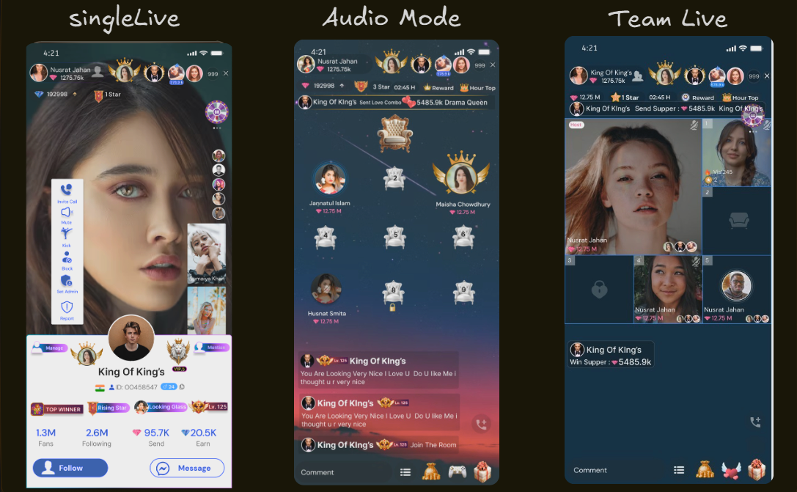

-----

# Realtime | OpenSource | WebRtc | Livekit 👋
# Welcome to QuickMeet - Your Realtime virtual meeting platform🐥


## 🔥🔥🔥 Latest News

- Feb 1, 2025: QuickMeet-1 is here 🎉. We've released the Complete Backend SDK code — check it out!
---

## 🚀 Overview

LiveStreamX is a powerful backend SDK that supports a wide range of live streaming scenarios including:

- 🔹 **Single Live**
- 🔹 **Audio Live**
- 🔹 **Multi-Guest Live**
- 🔹 **PK Battle Mode**

With an emphasis on **real-time engagement**, **moderation**, and **customization**, LiveStreamX brings studio-grade features to your fingertips — ready for integration across **mobile** and **web** platforms.

---

## 🧩 Supported Live Modes & Features

### 1. 🎭 Single Live with Multiple People Joining in Call

A single host goes live — viewers can **request** or be **invited** to join via **video/audio calls**.

#### ✅ Features:
- **🛠️ Live Room Creation**: Name, categorize, and manage privacy settings.
- **📲 Join & Invite**: Audience requests + host invitations with approval system.
- **👥 Multi-Guest Call Support**: Up to 4–6 guests with adaptive layout.
- **💬 Live Chat**: Real-time chat with emoji/GIF support.
- **🧑‍💼 Audience Management**: Mute, block, or remove participants.
- **🎁 Gifts & Reactions**: Virtual gifts + animated emoji reactions.
- **🛡️ Moderation Tools**: Delete comments, clear chats, and report.
- **📡 Technical Excellence**: Adaptive bitrate + real-time sync.

---

### 2. 🎤 Single Live

One host. One stream. Unlimited engagement.

#### ✅ Features:
- **🛠️ Customizable Room Setup**
- **📹 High-Quality Video**: 720p/1080p, beautify filters, lighting control.
- **💬 Chat System**: Emojis, GIFs, real-time updates.
- **🧑‍💼 Viewer Management**: Block/mute options.
- **🎁 Gifts & Leaderboard**: Real-time ranking for top gifters.
- **📣 Social Sharing**: Share streams across platforms.
- **💸 Monetization**: Pay-per-view/private room options.
- **📊 Host Analytics**: Viewer stats, gift count, earnings.

---

### 3. ⚔️ PK Live (Player Knockout)

Two hosts go live head-to-head in a **battle of engagement**!

#### ✅ Features:
- **🔗 PK Matchmaking**: Invite another host to duel.
- **⏳ Countdown Start**
- **🎯 Voting & Gifts**: Audience votes and gift counts influence the winner.
- **🖥️ Split-Screen Display**: Dual host layout.
- **🏆 Live Score + Winner Animation**
- **💬 Audience Interaction**: Chat, reactions, and support.
- **🛡️ Individual Moderation**: Each host manages their chat.

---

### 4. 🎧 Audio Live

Go live with your **voice** and let the vibes flow.

#### ✅ Features:
- **🎙️ Audio-Only Rooms**: With full room customization.
- **🗣️ Join Requests**: Listeners can request speaking slots.
- **🔇 Audio Controls**: Mute/unmute, remove speakers.
- **💬 Listener Chat**: Real-time messaging with engagement tools.
- **🎁 Voice Gifts**: Audio-friendly gifting experience.
- **🎶 Sound Effects**: Play music or fun SFX during stream.
- **🔊 Audio Tech**: Noise suppression + echo cancellation.

---

## 🧰 Core Modules Included

This SDK ships with robust support for:

- ✅ **Single Live**  
- ✅ **Audio Live**  
- ✅ **Multi-Guest Live**  
- ✅ **PK Battle Mode**  

Everything you need is bundled into a modular and scalable backend structure — ready for plug-and-play deployment!

---

## 🌍 Global Features (Available in All Modes)

- **📼 Recording & Playback**: Replay streams on demand.
- **🔐 Security**: End-to-end encryption + password-protected streams.
- **🧪 Cross-Platform Support**: Android, iOS, and web-ready APIs.

---

## 🧑‍💻 Developer-Friendly

- 🧩 Easy to Integrate  
- 📚 Clean API Documentation (Coming soon)  
- 🌐 RESTful APIs + WebSocket Support  
- 🛠️ Built with scalability in mind

---

## 📦 Getting Started

Coming soon — full setup and integration guide!

---

## 👨‍🎨 Designed For:

- 🧑‍🎤 Content Creators  
- 🎓 Ed-Tech Platforms  
- 🧑‍🏫 Virtual Events & Workshops  
- 🧑‍💼 Businesses & Influencers  
- 🕹️ Gaming Streamers  

---

## ✨ Inspired By

> Platforms like **Bigo Live**, **Jigocloud**, and **Agora** — reimagined with flexibility, creativity, and control.

---

Made with by Ali Hamza❤️ for the future of live interaction.


## Feel free to Contribute 😁🛠 Be it code or non-code 😉
## Steps to follow 📃

## Contents

[1. Fork the project 🔪](https://github.com/alihamza1221/quickMeet/edit/master/README.md#1-fork-the-project-) <br>
[2. Clone the forked repository 📥](https://github.com/alihamza1221/singleclub/edit/master/README.md#2-clone-the-forked-repository-)<br>
[3. Let us Setup 🔧⚙️](https://github.com/alihamza1221/singleclub/edit/master/README.md#3-let-us-setup-%EF%B8%8F)<br>
[4. Keep in sync always♻️ (best practice🤝🏻) ](https://github.com/alihamza1221/quickMeet/edit/master/README.md#4-keep-in-sync-always%EF%B8%8F-best-practice)<br>
[5. Ready for the contribution 🌝](https://github.com/alihamza1221/quickMeet#5-ready-for-the-contribution-)<br>
[6. Installing packages required 📦📥](https://github.com/alihamza1221/quickMeet#6-installing-packages-required-)<br>

### 1. Fork the project 🔪

   [Fork Button](https://github.com/alihamza1221/quickMeet)

### 2. Clone the forked repository 📥

  You need to clone (download) it to your local machine using below command in terminal
```bash
   $ git clone https://github.com/Your_Username/quickMeet.git
```
> This makes a local copy of the repository in your machine 📂

  Once you have cloned the `Quick-Meet-SDK` repository in Github, move➡️ to that folder first using the change directory `cd` command on Linux/ Mac/ Windows
```bash
   $ cd Quick-Meet-SDK
```

### 3. Let us Setup 🔧⚙️
Run the following commands to verify that your _local copy_ has a reference to your _forked remote repository_ on Github
```bash
   $ git remote -v
```
It should display the below output
```
  origin  https://github.com/Your_Username/quickMeet.git (fetch)
  origin  https://github.com/Your_Username/quickMeet.git (push)
```

Now, let us add the reference to the original `quickMeet` repository using the below command 🔙
```bash
  $ git remote add upstream https://github.com/quickMeet/quickMeet.git
```
> The above command creates a new remote as `upstream`

To Verify the changes run the below command
```bash
  $ git remote -v
```
Output in console ☑️:
```
  origin    https://github.com/Your_Username/quickMeet.git (fetch)
  origin    https://github.com/Your_Username/quickMeet.git (push)
  upstream  https://github.com/alihamza1221/quickMeet.git (fetch)
  upstream  https://github.com/alihamza1221/quickMeet.git (push)
```

### 4. Keep in sync always♻️ (best practice🤝🏻) 
It is a better practice to keep the `local copy` in sync with the `original repository` and to stay updated with the latest changes. Run the below commands before making changes or in regular intervals to stay updated with the `base` branch

```
  # Fetch all remote repositories and delete any deleted remote branches
  $ git fetch --all --prune

  # Switch to the master branch
  $ git checkout master

  # Reset the local master branch to match the upstream repository's master branch
  $ git reset --hard upstream/master

  # Push changes to your forked quickMeet repo
  $ git push origin master
```

### 5. Ready for the contribution 🌝
Once you are done with the above steps, you are ready to contribute to the `QuickMeet` project code. Check out the `issues` tab of the `original repository` and solve them. Once you are done with your changes, submit your efforts with a `pull request`

## Hold on! Instructions are not done yet 🌚

### 6. Installing packages required 📦📥

To install the required packages run the below command
```bash
   npm install
```
## Help us improve the project better 📈🤗

Please discuss your concerns with [Ali Hamza](https://alilive.xyz/) before creating a new issue. 😉

_Please `STAR`⭐️ the repository if you like the content and code_**😁

_Also enable the `WATCH`👁 button to keep watching the updates on the repository_**😉

💯💻🧑‍💻👩‍💻 Happy Contributing 👩‍💻🧑‍💻💻💯


